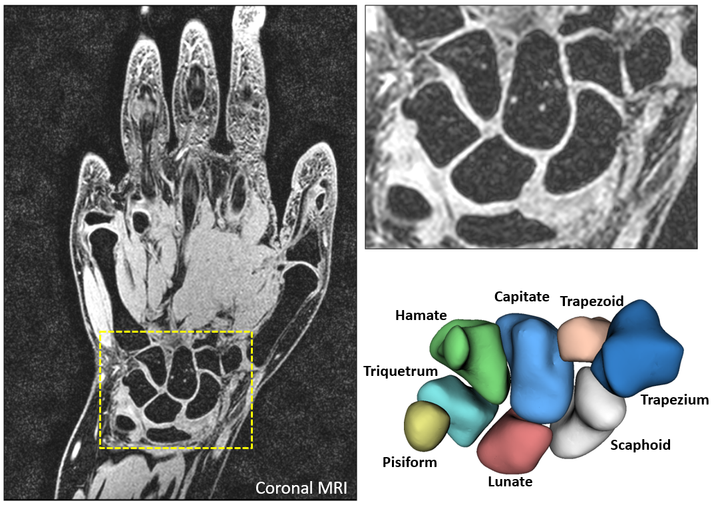
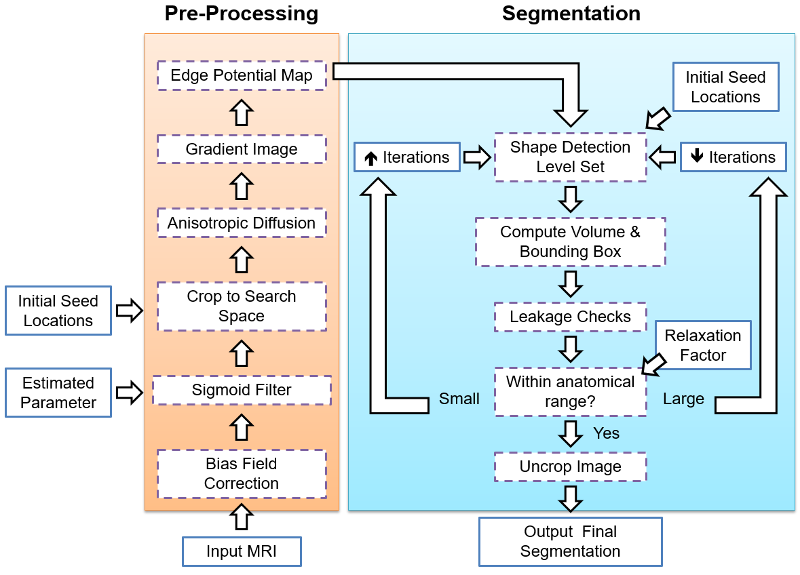
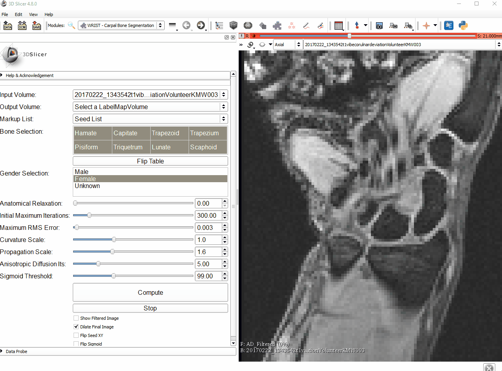

WRIST-Segmentation 3D Slicer Module
=============
The 3D Slicer implementation of the method described in  [Foster et al. "WRIST-A WRist Image Segmentation Toolkit for Carpal Bone Delineation from MRI" *Computerized Medical Imaging and Graphics* (2017)](http://www.sciencedirect.com/science/article/pii/S0895611117301313). 

Please email Brent Foster at bhfoster@ucdavis.edu or Abhijit Chaudhari at ajchaudhari@ucdavis.edu with any questions, comments, or suggestions. 

Purpose 
-------	

This is a plugin, i.e. module, for the free open source medical image processing software [3D Slicer](https://www.slicer.org/) for semi-automated segmentation of the wrist carpal bones from MRI. It utilizes several functions from the [SimpleITK](http://www.simpleitk.org/) library for processing and segmentation along with some novel parameter optimizations. 

An accurate segmentation of the bones is cruical for image analysis including shape analysis, kinematic modeling, disease diagnosis and tracking, among many others. This plugin allows users to control parametrs of the method for fast and accurate results, even with high resolution datsets.

    
    <em>Example MRI of the wrist and a rendering of the eight carpal bones. The method aims in segmenting the image to provide the boundaries of these bones.</em>

Method Demo
-------	

    
    <em>Animation of the WRIST module being used to segment the eight carpal bones of the wrist. Note: the animation is in real time. </em>

### Steps
See the animation above for a demonstration of the following steps.
1. Load a MRI image of the wrist into 3D Slicer. 
2. Select the input and output volumes by using the selectors.
3. Select create new markup list.
4. Using the 3D Slicer fiducial marker tool, click once per bone. 
5. Use the Bone Selection table to click on the bones in the same order as the fiducial markers were selected in.
6. Select male, female, or unknown for gender.
7. Modify any parameters as needed. The "Show Filtered Image" checkmark can be helpful (also demonstrated below). 
8. Click on the Compute button. 
9. If needed, use the 3D Slicer manual segmentation tool to fix any small segmentation errors or adjust the parameters slightly. 

    
    <em>Rendered segmentation result from the above method demo animation.</em>

Flowchart
-------	

    
    <em>Flow chart overview of the method. Please see the corresponding paper for more details. </em>

Installation
-------	
Install the 3D Slicer program if needed. The software is free and open source with downloads provided on https://www.slicer.org/

After installation of 3D Slicer, download the "WRIST.py" file from this GitHub repository. Put it in a folder on your computer (an empty folder is recommended for faster loading).

Next, open the 3D Slicer and go to "Edit", then "Application Settings", then "Modules".

Click on the "Add" button on the right to add an additional module path. 

Select the folder where the "WRIST.py" file is saved on your local computer.

Restart 3D Slicer.

You should now see a folder named "Wrist Segmentation" with the module inside. If not, use the search button or the drop down in the top left in 3D Slicer. 

Alternatively, the module will soon be added to the 3D Slicer Extensions Manager which will allow it to be installed with just a single button.

Troubleshooting Guide
-------	

> Does the order of the bones selected matter?

No, it does not matter as long as there is one seed point per bone and the Bone Selection table is clicked in the same order. You can also do a subset of the bones as desired. In the final segmentation, the bone labels will be as follows regardless of the selecting order:
Trapezium (1), Trapezoid (2), Scaphoid (3), Capitate (4), Lunate (5), Hamate (6), Triquetrum (7) and Pisiform (8).

> Is there a way to change the bone labels in the segmented image?

Not currently. However, the builtin 3D Slicer manual segmentation module (called the "Editor") has the ability to change the labels to some other number if needed. 

> Which parameter is the most sensitive? Which one should I adjust first!?

The [corresponding paper](http://www.sciencedirect.com/science/article/pii/S0895611117301313) goes into details about this, but I would recommend always adjusting the Sigmoid Threshold Slider first. This is likely the most important parameter to adjust. See the below suggestion on using the "Show Filtered Image" checkbox to see a preview of the edge potential map.

> What is the flip table for?

It mirrors the table names. This would be useful when the image is mirrored (left to right) versus the names in the table. 

> What is the anatomical relaxation parameter used for?

 This parameter in the plugin performs checks on the segmentation result for each bone to estimate whether the method has converged onto the bone boundary or not, as described in the [corresponding paper](http://www.sciencedirect.com/science/article/pii/S0895611117301313). A value of 0 means to attempt to have the volume of each bone to be within a standard range for the inputted gender. A value of 0.1 mean to attempt to have a volume within plus or minus 10 percent of of the standard range for each bone. 

If the bone volume is outside the range, the method adjusts the parameters to correct for non-convergence. 

Select a value of 1 for the parameter to ignore and skip the convergence checks.

> How do I turn off the convergence checks?

Simply set the anatomical parameter to a value of 1 to skip any checks on convergence.

> The segmentation is leaking into the background! What do I do?

First, attempt a new sigmoid threshold parameter. An easy way of selecting an appropriate value is to use the "Show Filtered Image" checkmark. See the animation below for an example of this. The image being shown is a preview of the edge potential map (without the anisotopic diffusion pre-processing to speed up this preview). 

Options for further improvement:

1. Adjust the Sigmoid Threshold slider until you see the edges of the bones being outlined as clear as possible.
2. Decrease the anisotropic diffusion iterations. Sometimes it can cause the edge of the bone to be blurred out in the image.
3. Decrease the propagation scale parameter. This is the expansion force on the level set, and adjusting this will often solve the leakage issue.
4. Decrease the initial maximum iterations.
5. Try moving the initial seed location to a non-noisy part of the bone.

    
    <em>The "Show Filtered Image" checkmark is useful for finding a good value for the Sigmoid Threshold parameter.</em>

> Can I also see what the anisotropic diffusion filter does?

Yes. Use the same approach as the sigmoid threshold preview above. First select the "Show Filtered Image" checkmark and adjust the slider for the Anisotropic Diffusion Iterations. Note that if your image is large, it can take ~10 seconds for computing.

Please see the below animation of the anisotropic diffusion filter preview. 

    
    <em>The "Show Filtered Image" checkmark is also useful for finding a good value for the Anisotropic Diffusion parameter.</em>

> The segmentation is not growing enough! What do I do?

First, attempt a new sigmoid threshold parameter. A simple way of selecting an appropriate value is to use the "Show Filtered Image" checkmark. See the animation above for an example of this. The image being shown is a preview of the edge potential map (without the anisotopic diffusion pre-processing to speed up this estimation). 

Options for further improvement:
1. Increase the number of anisotopic diffusion filter iterations. It is good at removing noise from the image. The noisy pixels may be the issue. 
2. Increase the propagation scale parameter to increase the 'growing' force of the level set.
3. Decrease the maximum RMS error parameter.
4. Try the MRI bias correction filter in 3D Slicer or other filtering options in Slicer if the image is quite noisy.

> Can I see a preview of the anisotropic diffusion filter along with the sigmoid threshold?

Yes. Do the anisotropic filter preview first, then change the Input Volume of the module to the image named "AD_Filtered". Lastly, adjust the sigmoid threshold. This will apply the sigmoid threshold to the anisotropic filtered image. This might make it possible to select a better sigmoid parameter. 

> Does it matter where the seed is located within the bone?

Not much as long as it is a few pixels away from the bone edge. Ideally, the seed location will be in approximately the center of the bone (just don't click on the bone edge).

> I clicked on the Compute button and nothing happened! What should I do?

Double check that you have selected 1) an Input Image, 2) an Output Image, 3) a Markup List, 4) the corresponding bones in the Bone Selection table, and 5) a selection in the Gender Selection table. The button will not be enabled until all the inputs are selected.

> What does the Flip Sigmoid checkmark do?

This is an experimental feature which might be useful for segmenting the bones from CT images. It flips the alpha and beta of the sigmoid filter (see https://itk.org/SimpleITKDoxygen/html/classitk_1_1simple_1_1SigmoidImageFilter.html for details on the function). 

Try the "Flip Sigmoid" checkmark along with the "Show Filtered Image" checkmark to see how the image changes after adjusting the Sigmoid Threshold parameter. 

> What is the Stop button for?

This button is for the users to stop and modify parameters without having to wait for all the bones to be segmented. If the user decides that the first bone segmentation did not work well, clicking the stop button will stop the method immediately while generating the output of the current segmented bones. 

